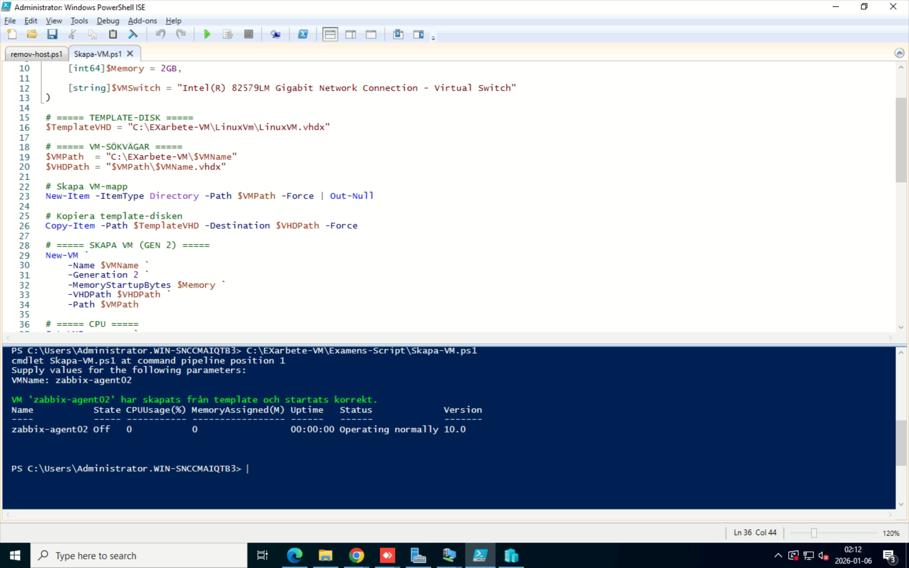
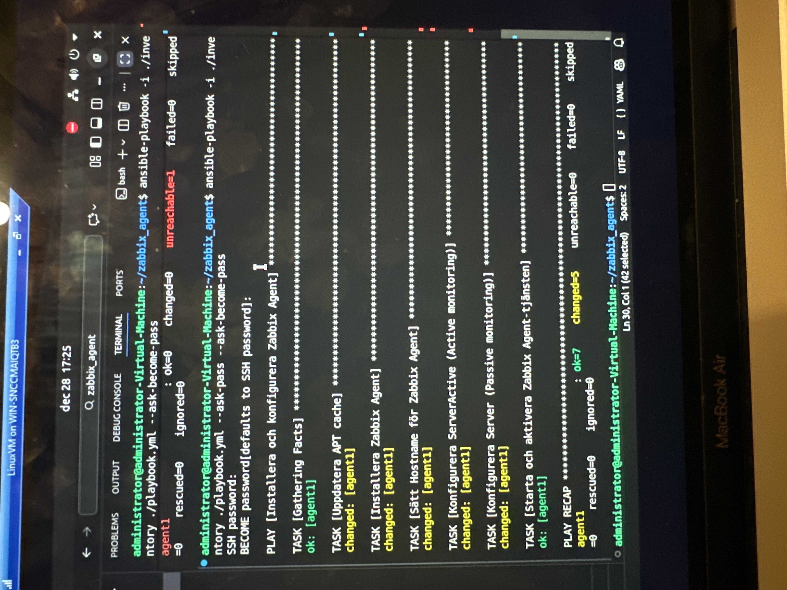
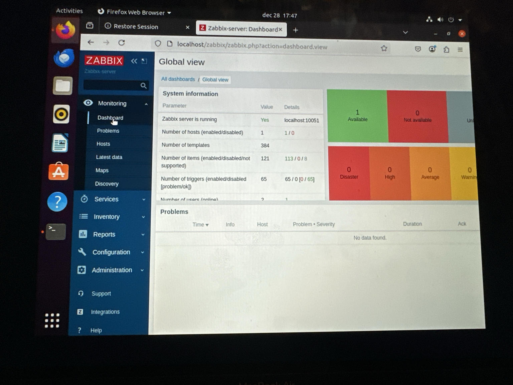
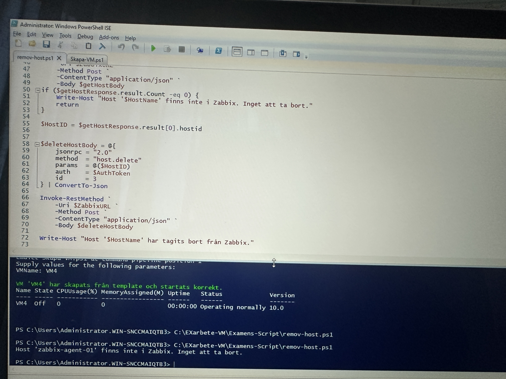

# DevOps Examensarbete – Automated VM Lifecycle & Monitoring

## 📌 Projektöversikt

Detta examensarbete demonstrerar ett komplett automatiserat flöde för livscykelhantering av virtuella maskiner med integrerad övervakning.

Projektet kombinerar Infrastructure as Code, konfigurationshantering och API-integration.

---

## 📂 Project Structure

devops-examensarbete/
├── scripts/
│ └── powershell/
│ └── create-vm.ps1
├── ansible/
│ └── playbook.yml
├── zabbix-api/
│ └── remove-host.ps1
├── screenshots/
└── README.md

-----
## ⚙️ Funktionalitet

1. Virtuella maskiner skapas automatiskt i Hyper-V (PowerShell)
2. Ubuntu installeras
3. Zabbix Agent installeras och konfigureras automatiskt med Ansible
4. Active monitoring aktiveras i Zabbix
5. Vid borttagning av VM rensas även all övervakningsdata via Zabbix API

---

## 🛠️ Tekniker

- Windows Server 2022 & Hyper-V
- PowerShell
- Ubuntu 20.04 LTS
- Ansible
- Zabbix 6.0 LTS
- REST API (JSON-RPC)

---

## ▶️ How to Run (High-Level Overview)

### 1️⃣ Create Virtual Machine
Run the PowerShell script:

.\create-vm.ps1 -VMName TestVM


2️⃣ Install Zabbix Agent with Ansible

From the Ansible controller:
```Bash
ansible-playbook playbook.yml --ask-pass --ask-become-pass
```

3️⃣ Verify Monitoring in Zabbix

Log in to the Zabbix Web GUI

Navigate to Monitoring → Hosts

Verify that the host status is Available

4️⃣ Cleanup VM + Monitoring

Run the cleanup script:

.\remove-host.ps1

This removes:

The virtual machine (Hyper-V)

The Zabbix host entry via API

All related monitoring data


## 🧱 Arkitektur (Förenklad)

PowerShell → Hyper-V → Ubuntu VM  
Ansible → Zabbix Agent → Zabbix Server  
PowerShell + Zabbix API → Cleanup

---

## 🎯 Vad jag lärde mig

- Automatisering av infrastruktur
- Konfigurationshantering
- API-integration
- Felsökning i Linux & Windows-miljö
- Bygga reproducerbara och skalbara lösningar

---

## 📷 Screenshots
### 🔹 VM Creation (PowerShell)


### 🔹 Ansible Automation


### 🔹 Zabbix Monitoring Active


### 🔹 Zabbix API Cleanup


---

## 🚀 Syfte

Projektet visar hur DevOps-principer kan användas för att automatisera hela livscykeln för virtuella maskiner inklusive övervakning och rensning.
